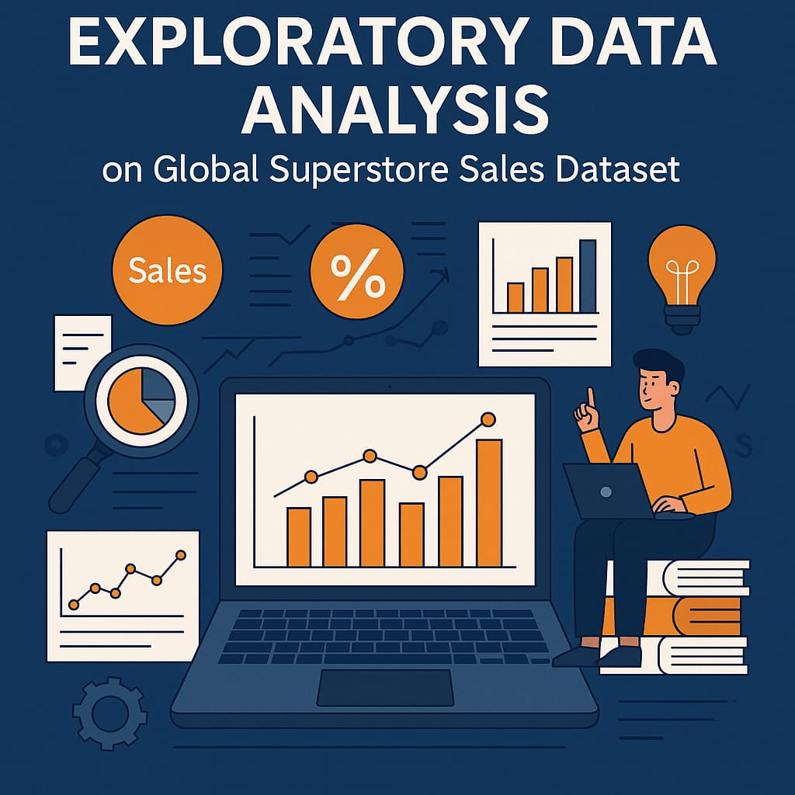

# Exploratory Data Analysis on Global Superstore Dataset

## 📌 Problem Statement

The goal of this project is to develop learners' skills in understanding retail datasets and drawing actionable business insights by performing EDA on the Global Superstore dataset.

---

## 📂 Dataset

- **Name**: Global Superstore Dataset  
- **Source**: [Kaggle - Superstore Dataset Final](https://www.kaggle.com/datasets/vivek468/superstore-dataset-final)
- **Format**: CSV  
- **Key Variables**: Order Date, Region, Segment, Category, Sales, Quantity, Discount, Profit

---

## 🎯 Business Use Cases

- **Retail Strategy Planning**: Identify best regions, products, and customers.
- **Inventory Optimization**: Analyze order trends to manage stock.
- **Revenue Forecasting**: Trends in profit and delivery patterns.
- **Customer Analysis**: Segment customers for better targeting.

---

## 🔍 Approach

1. Load and explore the dataset
2. Clean data: handle missing values, outliers, and duplicates
3. Univariate analysis: distributions of individual variables
4. Bivariate/multivariate analysis: correlation, relationships
5. Time series analysis on order dates
6. Visualizations: matplotlib, seaborn, plotly
7. Summary of key business insights

---

## 💾 Setup Instructions

```bash
# Create and activate environment
python -m venv superstore_env
superstore_env\Scripts\activate

# Install dependencies
pip install -r requirements.txt

# Launch notebook
jupyter notebook

📊 Project Deliverables
Jupyter Notebook: eda_superstore.ipynb

Data Cleaning Script: data_cleaning.py

Interactive Visualizations

Summary Report with Business Insights

📈 Evaluation Metrics
✅ Depth and Breadth of EDA

✅ Clear Visualizations

✅ Business Insightfulness

✅ Code Quality and Comments

✅ Notebook Presentation

GlobalSuperstore_EDA/
│
├── data/
│ └── Superstore.csv
│
├── notebooks/
│ └── eda_superstore.ipynb
├── README.md
└── requirements.txt


---

### 2. 🛠️ Environment Setup

```bash
# Step 1: Create virtual environment
python -m venv venv
# Step 2: Activate it
# Windows:
venv\Scripts\activate
# Linux/macOS:
source venv/bin/activate

# Step 3: Install dependencies
pip install -r requirements.txt


📌 Approach
Data Loading & Inspection: Understand the structure, types, and missing values.

Data Cleaning: Handle nulls, duplicates, and parse dates.

Univariate Analysis: Distributions of sales, profit, region, category.

Bivariate/Multivariate Analysis: Relationships between discount, sales, profit, etc.

Time Series Analysis: Trends over months and years.

Visualizations: Bar plots, heatmaps, box plots, and line charts.

Key Findings Summary: Insights for business decisions.

📈 Visualizations Include
Sales & Profit by Region

Category-wise Performance

Shipping Mode vs Profit

Discount Impact on Profit

Time Series Sales Trends

✅ Results & Insights
Identified most and least profitable regions and categories.

Discounting strategy revealed diminishing returns.

Central region showed high sales volume but lower profits.

Office Supplies with high discounts underperform in profit.

📋 Evaluation Criteria
Depth of Analysis: Covers all major aspects.

Visualization Clarity: Proper labels, titles, legends.

Insightfulness: Real-world applicability.

Code Quality: Clean, modular, commented.

Presentation: Well-structured notebook or script.

🔖 Tags
EDA Pandas Matplotlib Seaborn Plotly Retail Analytics Python Data Cleaning Business Intelligence
