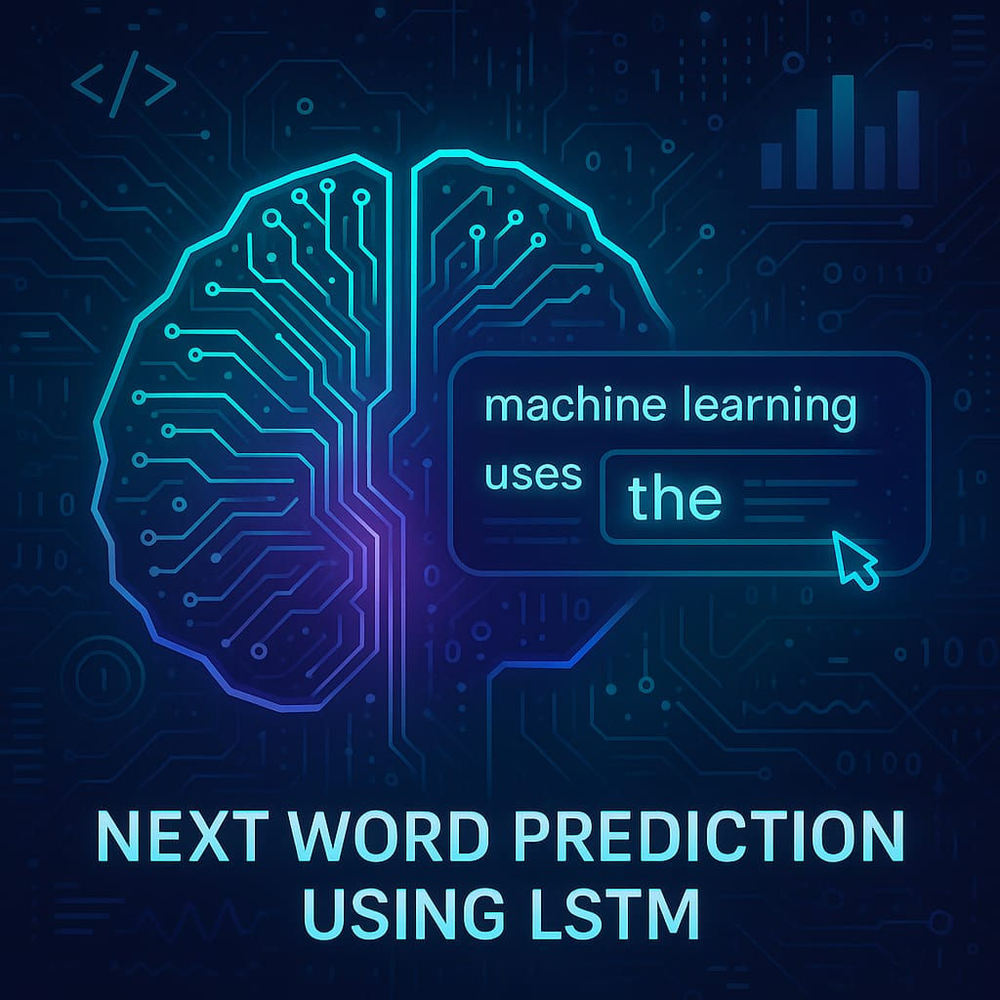

# 🔮 Next Word Prediction using LSTM

  

This project demonstrates a **Recurrent Neural Network (RNN)** based **Next Word Prediction** system using an **LSTM model** trained on the **WikiText-2 dataset**. It uses TensorFlow/Keras for model training and **Streamlit** for easy user interaction through a web interface.

---

## 📌 Project Structure

<pre> next_word_prediction_rnn/ │ ├── app.py # Streamlit web app for prediction ├── train_model.py # Model training script ├── requirements.txt # List of dependencies │ ├── model/ │ └── lstm_next_word_model.h5 # Saved trained model │ ├── utils/ │ ├── preprocessing.py # Data loading & preprocessing │ └── prediction.py # Next word prediction logic │ └── README.md # Project documentation </pre>
---
---

## 📚 Dataset Used

- **Name:** WikiText-2
- **Source:** Hugging Face Datasets Library (`wikitext`)
- **Content:** Well-formed, clean English articles from Wikipedia. Ideal for language modeling tasks.

---

## 🧠 Objective

To build a language model that:
- Learns context from historical word sequences.
- Predicts the **most probable next word** in a sentence.
- Is deployed as a lightweight web app for interactive use.

---

## ✅ Features

- LSTM-based language modeling.
- Clean preprocessing and tokenization.
- `<OOV>` (Out Of Vocabulary) filtering and smart handling.
- Memory-efficient design for systems with low RAM (like 5GB).
- Deployed using Streamlit for instant web use.

---

## 🛠️ Technologies & Libraries

| Category         | Tools Used                             |
|------------------|----------------------------------------|
| Language         | Python 3.10                            |
| Deep Learning    | TensorFlow, Keras                      |
| Data             | Hugging Face Datasets (wikitext)       |
| UI               | Streamlit                              |
| Tokenization     | Keras Tokenizer                        |
| Deployment       | Localhost (http://localhost:8501)      |

---

## 📦 Installation & Setup

### 1. Clone the Repository
---
git clone https://github.com/yourusername/next_word_prediction_rnn.git
cd next_word_prediction_rnn

### 2. Create a Virtual Environment
python -m venv nwp_env
nwp_env\Scripts\activate   # Windows

### 3. Install Dependencies
pip install -r requirements.txt

### 📂 requirements.txt

tensorflow==2.15.0
streamlit==1.35.0
datasets==2.18.0
numpy
⚠️ Make sure your system uses Python 3.10 to avoid TensorFlow installation issues.

### 🚀 How to Train the Model

python train_model.py

This will:

Load and preprocess the WikiText-2 dataset.

Train the model for 10 epochs (you can change this).

Save the trained model to model/lstm_next_word_model.h5.

### 💬 How to Run the App
streamlit run app.py
Visit: http://localhost:8501 in your browser.

### Example:
Input: deep learning models are
Output: deep learning models are **trained**

### 🧪 Example Predictions
Input Text	Predicted Next Word
machine learning is a	field
natural language processing	tasks
artificial intelligence and	machine
deep learning can	help

### ⚙️ Model Details
Embedding Layer: Transforms word indices into dense vectors.

LSTM Layer: Learns sequential context.

Dense Layer (Softmax): Outputs probability for each word in vocab.

### 🧠 Training Settings
Parameter	Value
Sequence Length	5
Vocabulary Size	20,000
Batch Size	128
Epochs	10
Loss	Sparse Categorical Crossentropy
Optimizer	Adam

### ⚡ Limitations
On low-RAM systems, larger vocab sizes (>20k) may crash training.

<OOV> may still appear if words are rare or improperly tokenized.

Limited prediction diversity (only top-1 prediction shown).

### 📈 To Improve Accuracy
Increase sequence length (e.g., 10 instead of 5).

Train for more epochs (15–20).

Use a bidirectional LSTM or GRU layer.

Include dropout and batch normalization.

Pretrain embeddings (like GloVe or Word2Vec).

### 🙌 Acknowledgements
- Hugging Face Datasets 
- TensorFlow 
- Streamlit 
